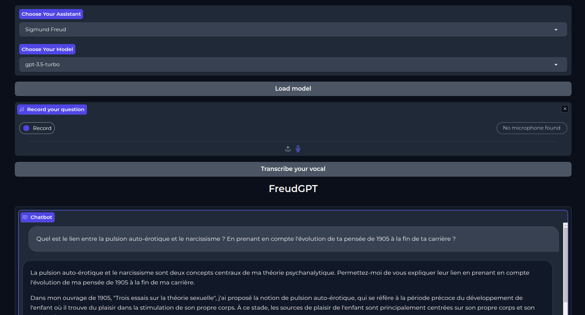

# FreudGPT - the psychologist assistant 

<p align="center">
  
</p>

**Choose the psychologist you would like advice from and try it out !** 
You can both *write* and *speak* to your assistant.

Simply launch the app with `python app.py`


<!-- UNDER THE HOOD -->
## Under the hood
An LLM is powering the chatbot. You can choose to use an open-source model or one of OpenAI's model if you have an API key. Also, you can talk to your assistant as voice input are now supported (Whisper).
The specialization into a psychologist persona is achieved through simple prompt-engineering.


<!-- ROADMAP -->
## Roadmap
- [x] Add possibility to use open-source LLMs
- [x] Add speech recognition (whisper) 
- [ ] Add fine-tuned LLMs on psychology content
- [ ] Go more multi-modal

Next I would like to fine-tune open-source models (probably on consumer hardware using QLoRA) on writtings from Freud, Winnicott, ... to make ithem better specialists.


<!-- WHAT THE APP LOOKS LIKE -->
## What the app looks like : 


<p align="center">
  
</p>


<!-- GETTING STARTED -->
## Getting Started

Simple instructions to get started using this web-app.

### Installation

If you are new to this and unsure whether Python is installed on your computer or how to use pip, you can refer to OpenAI's tutorial on getting started with building a Python environment. They provide a step-by-step and very clear explanation of the process. You can access their tutorial <a href="https://platform.openai.com/docs/quickstart?context=python">here</a>.

1. Clone the repo
   ```sh
   git clone https://github.com/NicolasPllr1/FreudGPT.git
   ```
2. Install python dependancies
   ```sh
   pip install -r requirements.txt
   ```
4. (optional) Add your openAI's API secret key to your environement
   ```sh
   export OPENAI_API_KEY='your-api-key-here'
   ```
### Usage

Simply launch the app with `python app.py`
