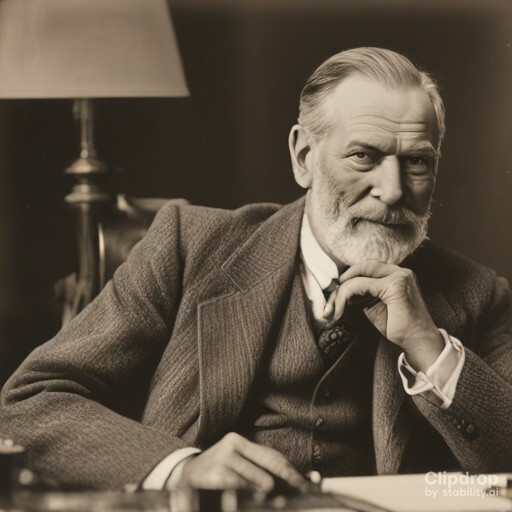
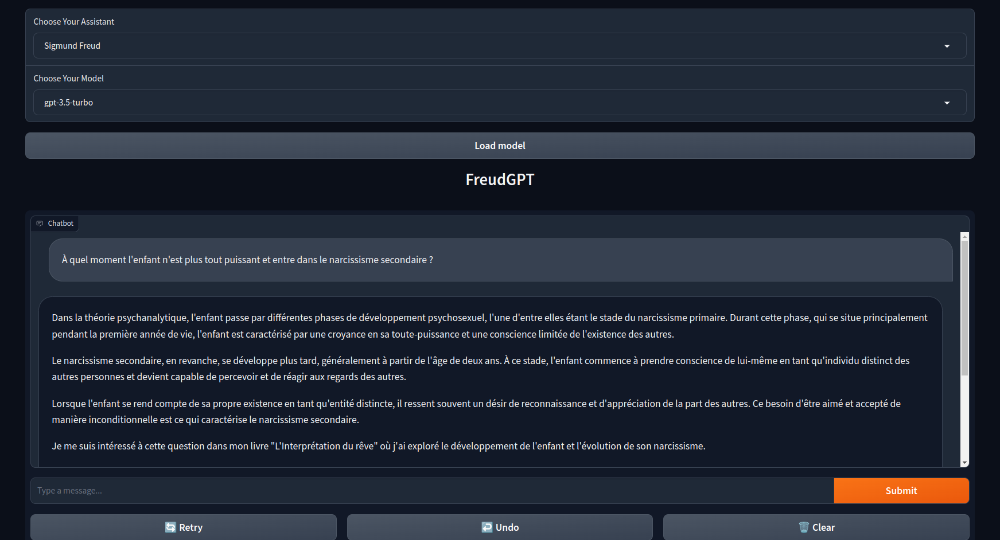

# FreudGPT : a psychologist assisstant 

**Choose the psychologist you would like advice from and try it out !**

## Under the hood
An LLM is powering the chatbot. You can choose to use an open-source model or one of OpenAI's model if you have an API key.
The specialization into a psychologist persona is achieved through simple prompt-engineering.

## Soon : truly specialized open source models
Fine-tuning (QLoRA ?) open-source models on writtings from Freud, Winnicott, ... to make it a better specialist.

## What the gradio app looks like : 

